# 2023.3.3

vue create vue 新建vue部分

使用npm安装了以下内容

npm i axios

npm i vuex@3

npm i vue-router@3

npm i element-ui

新建springboot项目

在pom文件中引入了以下内容

```xml
<dependencies>
        <dependency>
            <groupId>org.springframework.boot</groupId>
            <artifactId>spring-boot-starter-web</artifactId>
        </dependency>
        <dependency>
            <groupId>org.mybatis.spring.boot</groupId>
            <artifactId>mybatis-spring-boot-starter</artifactId>
            <version>2.3.0</version>
        </dependency>

        <dependency>
            <groupId>com.mysql</groupId>
            <artifactId>mysql-connector-j</artifactId>
            <scope>runtime</scope>
        </dependency>
        <dependency>
            <groupId>org.projectlombok</groupId>
            <artifactId>lombok</artifactId>
            <optional>true</optional>
        </dependency>
        <dependency>
            <groupId>org.springframework.boot</groupId>
            <artifactId>spring-boot-starter-test</artifactId>
            <scope>test</scope>
        </dependency>
        <dependency>
            <groupId>com.baomidou</groupId>
            <artifactId>mybatis-plus-boot-starter</artifactId>
            <version>3.5.3.1</version>
        </dependency>

        <!-- Excel导出工具 -->
        <!-- 基本依赖包 -->
        <dependency>
            <groupId>cn.hutool</groupId>
            <artifactId>hutool-all</artifactId>
            <version>5.8.11</version>
        </dependency>
        <!-- Excel包 -->
        <dependency>
            <groupId>org.apache.poi</groupId>
            <artifactId>poi-ooxml</artifactId>
            <version>5.2.2</version>
        </dependency>
        <!-- jwt: 不在服务端存放数据，通过token字符串来取代数据 -->
        <dependency>
            <groupId>com.auth0</groupId>
            <artifactId>java-jwt</artifactId>
            <version>3.10.3</version>
        </dependency>
        <!-- 引入mp代码生成器 -->
        <dependency>
            <groupId>com.baomidou</groupId>
            <artifactId>mybatis-plus-generator</artifactId>
            <version>3.5.3.1</version>
        </dependency>
        <dependency>
            <groupId>org.freemarker</groupId>
            <artifactId>freemarker</artifactId>
        </dependency>
        <!--        gson，用于java和json转换-->
        <dependency>
            <groupId>com.google.code.gson</groupId>
            <artifactId>gson</artifactId>
            <version>2.8.6</version>
        </dependency>
        <!--        springboot和websocket整合-->
        <dependency>
            <groupId>org.springframework.boot</groupId>
            <artifactId>spring-boot-starter-websocket</artifactId>
        </dependency>

    </dependencies>
```

有些依赖不一定会用到，之后会再做删改

# 2023.3.10

搭建了前端页面的部分内容

确定页面组成部分为：

1. Content组件：

   - LeftAside组件：侧边框
   - 右侧contaiiner

     1. Header组件：头部标签页
     2. 主体内容（通过路由控制显示）

路由部分：

```js
routes: [
        {
            path: '/',
            name: 'Content',
            component: () => import('@/components/Content'),
            children: [
                {
                    path: 'login',
                    name: 'Login',
                    component: () => import('@/pages/Login')
                },
                {
                    path: '/register',
                    name: 'Register',
                    component: () => import('@/pages/Register')
                },
            ]
        }
]
```

前端界面样式打算仿照一些知名音乐播放网站的样式来写

这是我们打算仿照样式的网站：[MyFreeMP3 (liumingye.cn)](https://tool.liumingye.cn/music/#/)

首次提交并推送了一下项目。这是git地址：https://github.com/ytrendfar/Project.git

初步的想法是先把页面做出来，再去写功能

下一步是做前端的主题色切换，和侧边栏的完善

# 2023.3.11

主要还是写前端

在App.vue中通过动态获取class来实现主题的切换

在vuex的state中保存一个变量来记录当前主题的名称供App.vue来获取

目前主题颜色中主要包括字体颜色、背景颜色和响应元素颜色

新建了Setting组件，目前能设置的只有主题色

个人中心里打算展示账号的信息和收藏歌曲之类的

目前写的算是用户端

还需要写一个管理员访问的页面，用来上传音乐和管理用户等

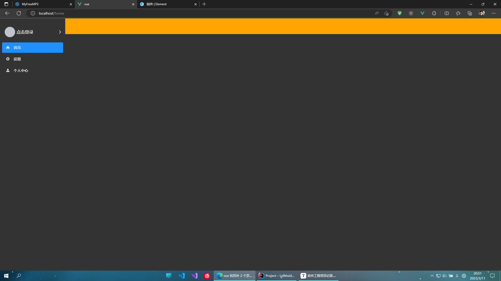

这是目前的效果。橙色的是header

# 2023.3.12

调整了一些边距。然后做了第二次推送

添加了header中前进和后退按钮

花费了大量时间来实现前进和后退功能的实现

一开始使用window.history的功能实现前进和后退，不过这样会导致在不断的后退中回退至打开页面前的网站

我希望的效果是在路由产生变化后才可后退，在回退过一次后才可以前进，前进至最新的路由后前进再次不可用

当回退一次后，路由如有变化前进再次不可用

后通过router的forward和back方法实现，效果和window.history相差不多，仍未解决问题

# 2023.3.13

主要完善header按钮功能

更换思路实现：在vuex的state中新建变量：

1. visitRoutes，数组，用于存储访问过的路由
2. index，存储当前路由所在的索引值，初始值为-1
3. need，布尔值，用于介定是否需要通过路由守卫。默认值为true

   当通过按钮控制页面前进或者后退时，不可通过路由守卫，否则会新增visitRoutes导致回退错误

在vuex的mutations中写三个函数：

1. goBack(state)，用于实现后退按钮点击后的效果：进行判断，如果索引index不在最左端即不为0，将need改为false代表要通过按钮操作路由，将index减一并调用router.back()
2. goForward(state)，和goBack类似，判断条件是索引不在最右端即索引不等于数组长度减一，然后将index加一并执行router.forward()，还有将need改为false
3. addVisited函数：存放在vuex的mutations中来响应新增路由。一旦被触发则代表不是通过按钮访问了某些路由，先删除索引所在位置后的所有元素，然后在数组末尾中添加传入的参数，再将索引加一移至最后一个元素

在路由守卫中通过beforeEach进行判断，如果vuex中的need值为true则需要通过守卫，执行vuex中的addVisited函数并传入参数to.path，即当前将要访问的路由；如果need值为false则代表通过按钮访问路由，修改need的值为false。最后执行next()放行

然后在header组件中设置按钮点击事件，触发vuex中存放的对应函数即可。

再设置按钮的样式，使后退按钮不可用时class为disabled，前进按钮通过v-if来控制是否显示。判断条件和mutations函数中的一致

然后就实现了按钮的前进和后退功能，不过和浏览器导航栏中的前进和后退按钮一起使用时可能会出错。考虑到一般用户不会这么做就暂且先不修复了

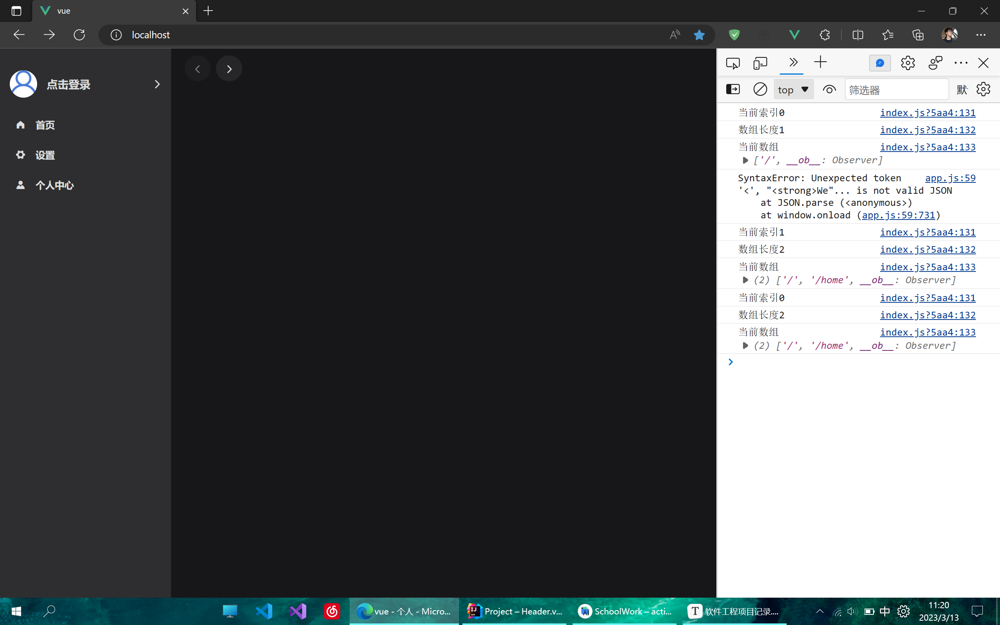

昨天还设置了一个默认显示的头像

在全局样式文件global.css中添加了禁止选取文字。后续在输入框的样式中再单独取消即可

在header添加了一个搜索框

通过npm下载了动画插件：npm install animate.css

然后实现的搜索框点击出弹窗的动画效果

在header中又添加了一个切换主题的按钮

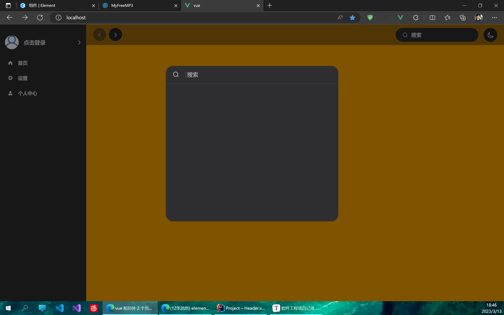

在header中新增了标签页，类似二级路由切换

安装了全局事件总线，用来在页面切换时在router中触发header组件中的回调函数来获取将要变换至的路由，这样就可以实时更新被触发标签页的显示，也用来区分不同路由下标签页显示的不同内容

在router文件中使用路由很麻烦。需要先在router中写一个函数用于获取vue实例对象从而能够调用$bus，将这个函数导出，在main.js中引入这个函数并调用，参数传入vue实例对象。然后在header中写bus的回调，在router中触发，参数就传路由守卫中的to.currentRoute.fullPath，然后就可以在路由更新的情况下实时更新header组件中的变量了

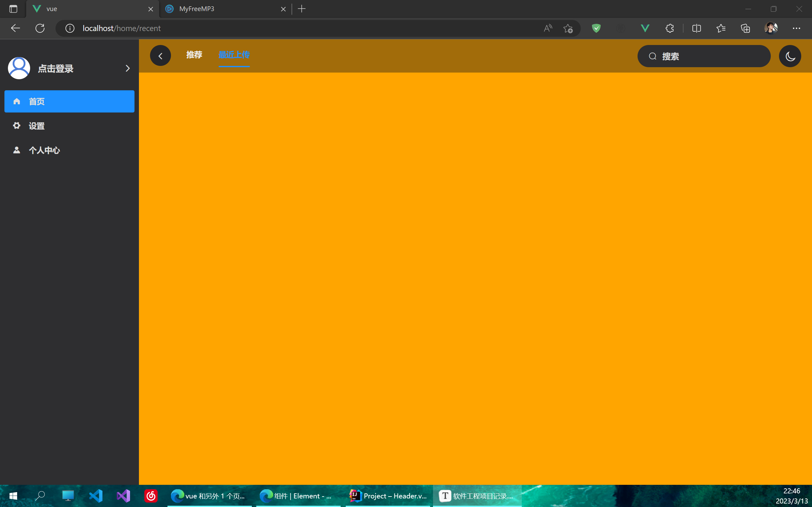

然后做了一次推送

# 2023.3.14

完成了登录、注册、找回密码三个组件的界面

新增了两个主题，实现了切换主题的功能。

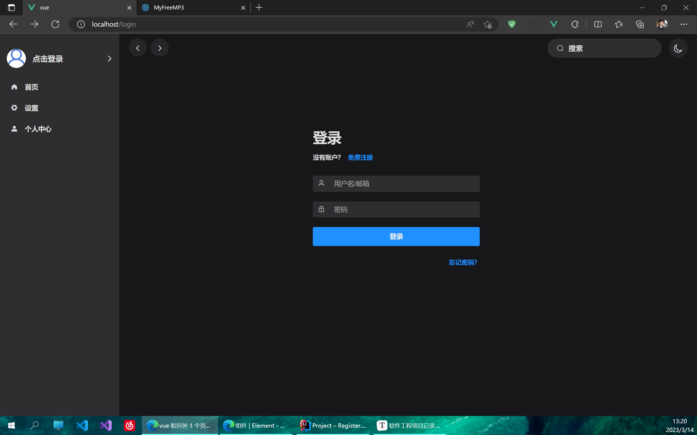

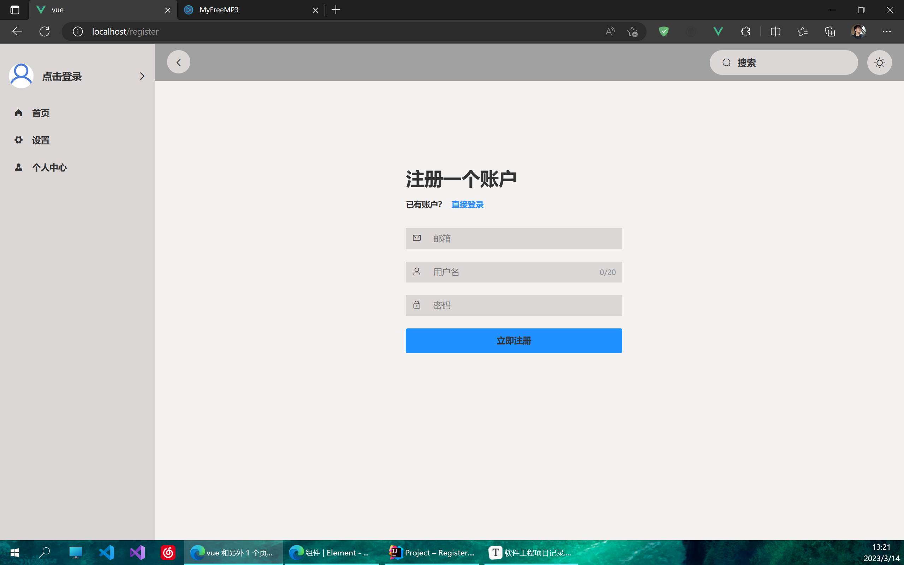

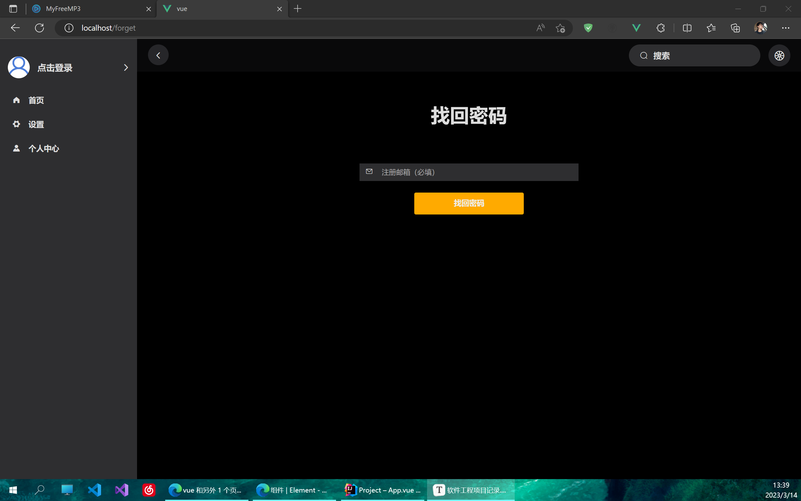

# 2023.3.15

实现前端登录和注册的功能

期间遇到错误：

```
org.springframework.beans.factory.BeanCreationException: Error creating bean with name 'userController': Injection of resource dependencies failed; nested exception is org.springframework.beans.factory.UnsatisfiedDependencyException: Error creating bean with name 'userService': Unsatisfied dependency expressed through field 'baseMapper'; nested exception is org.springframework.beans.factory.NoSuchBeanDefinitionException: No qualifying bean of type 'com.test.mapper.UserMapper' available: expected at least 1 bean which qualifies as autowire candidate. Dependency annotations: {@org.springframework.beans.factory.annotation.Autowired(required=true)}
```

从网上搜了半天最后通过在aplication类中加了一个注解@MapperScan解决

后端新增关于User的部分，包括controller、mapper、pojo还有DTO。我开始试图不用UserDto直接通过User对象接收，但由于数据库中的User没有token属性所以在登录方法中通过QuerryWrapper获取指定用户名和密码的User时会出错

新增统一返回结果类Result，存放常量的类Constants，全局异常处理类GlobalExceptionHandler，自定义异常类ServiceException

新增JwtInterceptor拦截器用于检测token

新增TokenUtils类用于生成token

新增配置类CorsConfig用于解决跨域问题，放行前端脚手架使用的80端口；InteceptorConfig类配置要放行的路径。目前将注册和登录两个功能放行

一些现成的工具类都直接从老项目里复制了

# 2023.3.16

主要是前端

完成了设置页面的内容，实现了在设置页面中切换主题和登出账号的功能

主题切换要实现和header中图标同步，通过全局时间总线进行了一系列配置

修改了登录后一些内容的显示，比如侧边栏的名称显示和设置后登出按钮显示

设置登录后点击侧边栏中名称跳转的页面由登录改为个人中心

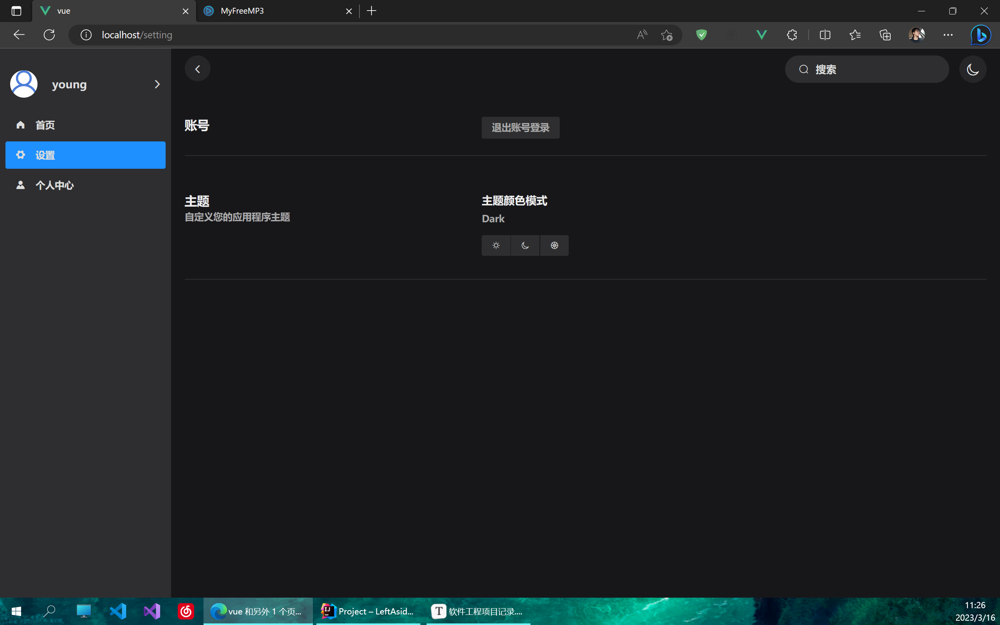

是否登录通过检测localStrorage中user项是否为null

在登录成功后会在浏览器内存中存储item为user的对象

# 2023.3.17

更改了部分路由结构

将侧边栏的个人中心改成了收藏列表

在登录后点击用户名或头像进入个人中心页面

搭建了个人中心页面的部分内容

彻底重写了主题的样式，使颜色分类更为详细

将Light和Dark两个主题的颜色进行了调整

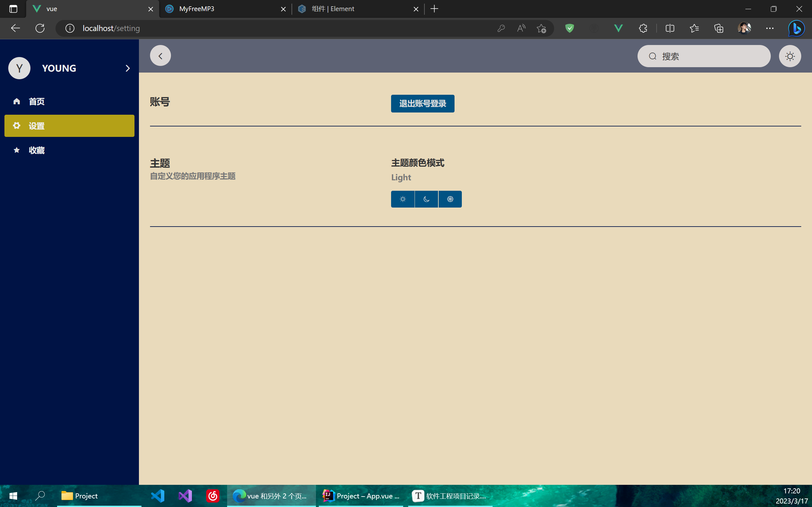

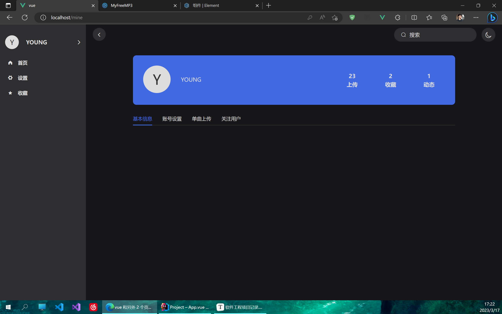

修改了默认头像的图片，实现登录后将头像换成用户名的大写首字母

其实感觉不用再设置一个上传头像的功能了，就这样也挺好。之后再看吧

# 2023.3.18

完善了个人中心页面的部分内容

实现了更新个人信息的功能

完成了第三套主题

项目组成员环境配置完成，项目可正常运行

修改了dark主题色的部分内容

修正了更新个人信息功能的部分内容

实现了一个点击按钮让未显示的输入框focus以及失去焦点取消显示输入框的小功能

其间遇到了@blur和@click事件冲突的问题

具体表现是点击按钮本应触发函数但优先触发输入框失去焦点的函数

解决办法是通过设置定时器让blur函数慢执行200ms

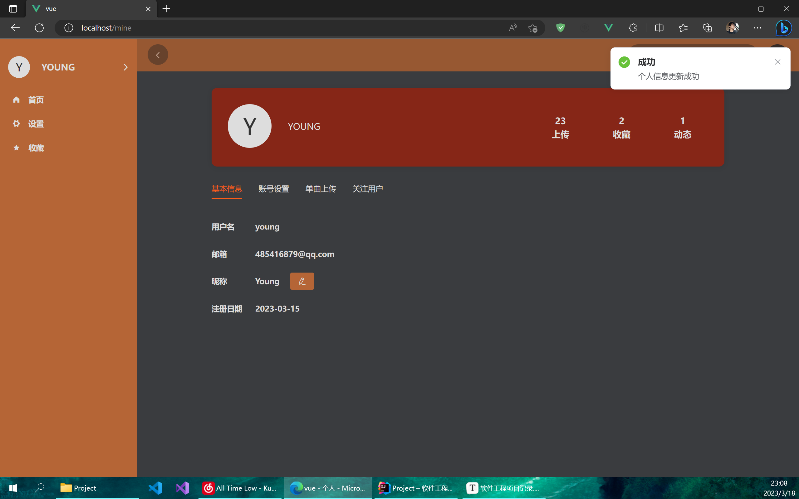


# 2023.3.19

补充了个人中心里账号设置的部分

添加了search页面，用于显示搜索后结果

新建了music表

修改了全局滚动条的样式，在content组件中实现了移出右半部分隐藏滚动条、移入显示滚动条的小功能

不过仅仅是通过修改visibility实现的隐藏，不能给其添加动画

opactiy属性在::-webkit-scrollbar中似乎不起作用

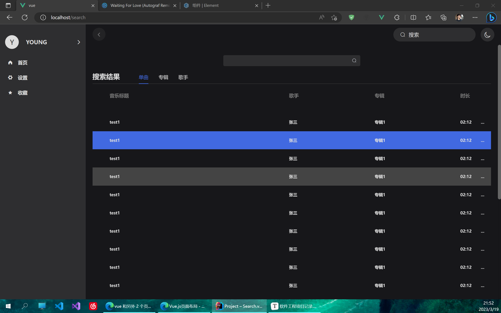

# 2023.3.20

新建了footer组件，用于在播放音乐时显示于底部

完成了footer中播放控件和音乐信息显示的样式

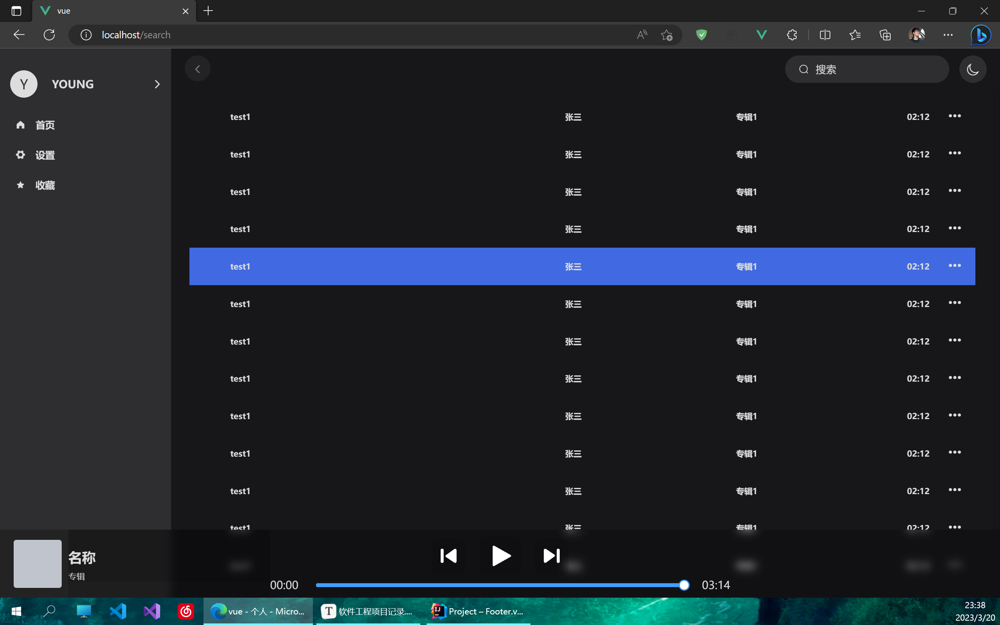

尝试做悬浮进度条根据鼠标位置显示tooltip的功能但太难没有实现。其中很多的样式不会修改

做完footer之后去做上传单曲的功能。还需要建一个专辑表。


# 2023.3.21

1. 完善了footer右半部分的按钮样式。其中引用了多个外部svg图标
2. 借鉴[javascript - Vue+ElementUI: 手把手教你做一个audio组件 - 洞香春 - SegmentFault 思否](https://segmentfault.com/a/1190000012453975) 的思路实现进度条的拖动功能以及和左侧时间、音频当前播放时间的绑定

3. 修改了左边栏的样式，新增了创建歌单的选项

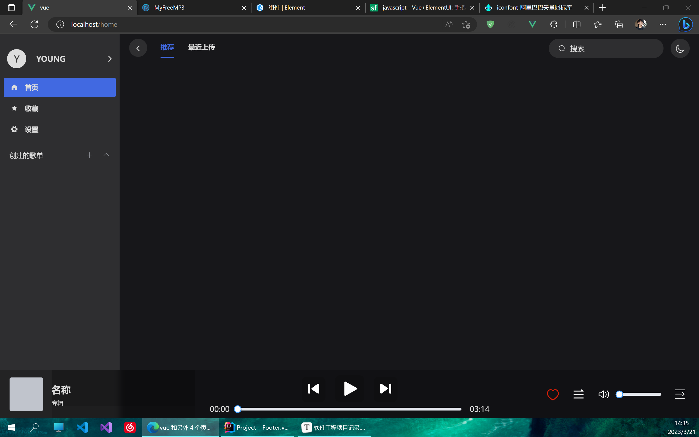

# 2023.3.22

1. 完善了footer中控件的功能，实现音量的控制等
1. 修复了播放条拖动位置显示错误的bug
1. 给播放顺序按钮添加了tooltip
1. 完成了白色主题search页面和footer的主题色完善
1. 实现了header中搜索框回车跳转并传参的功能

# 2023.3.23

1. 实现footer封面悬浮添加遮罩和icon，点击会切换至该音乐界面
2. 初步完成了music页面的编写
3. 将music页面取消并入footer


# 2023.3.24

1. 修复了弹出音乐界面后被部分元素遮挡的情况

   修改这些元素的z-index值后就解决了

   > z-index只对position属性为relative、absolute、fixed的元素生效

2. 完善了音乐界面的样式


3. 实现了音乐界面控件的功能

# 2023.3.25
