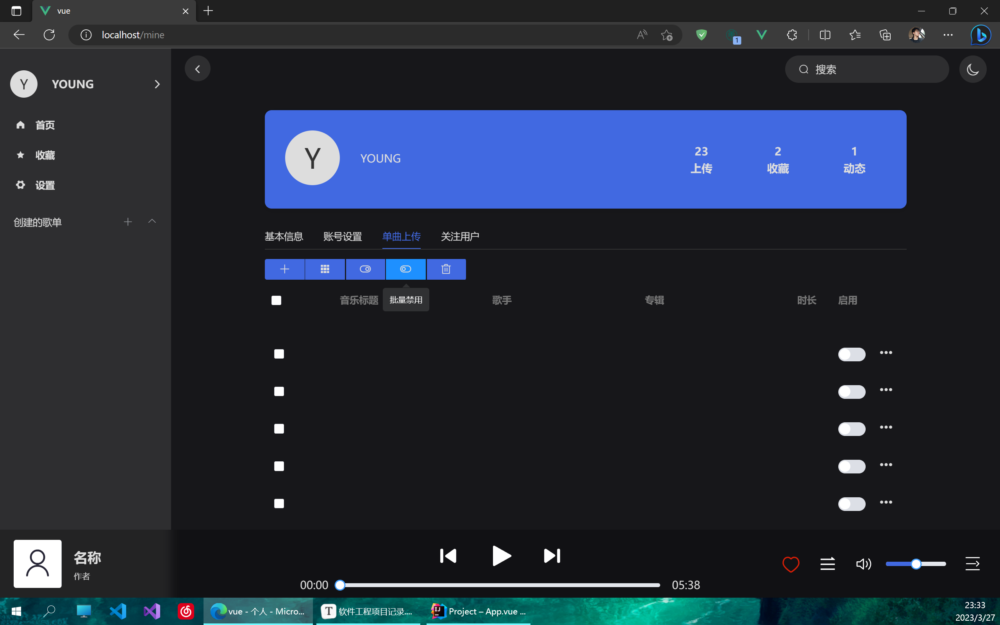
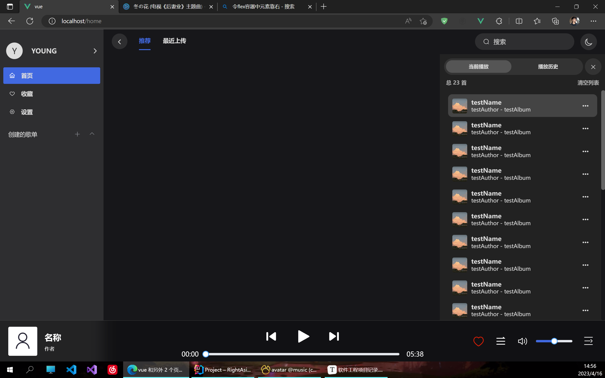
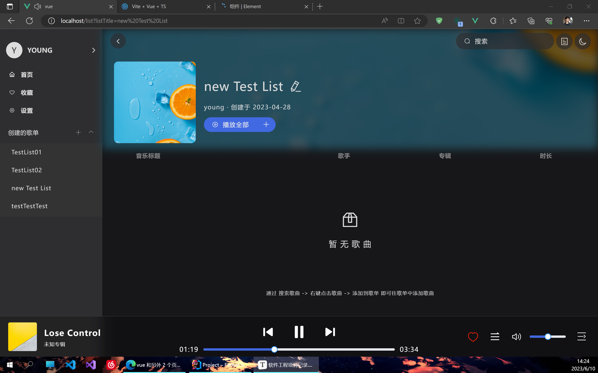

# 2023.3.3

vue create vue 新建vue部分

使用npm安装了以下内容

npm i axios

npm i vuex@3

npm i vue-router@3

npm i element-ui

新建springboot项目

在pom文件中引入了以下内容

```xml
<dependencies>
        <dependency>
            <groupId>org.springframework.boot</groupId>
            <artifactId>spring-boot-starter-web</artifactId>
        </dependency>
        <dependency>
            <groupId>org.mybatis.spring.boot</groupId>
            <artifactId>mybatis-spring-boot-starter</artifactId>
            <version>2.3.0</version>
        </dependency>

        <dependency>
            <groupId>com.mysql</groupId>
            <artifactId>mysql-connector-j</artifactId>
            <scope>runtime</scope>
        </dependency>
        <dependency>
            <groupId>org.projectlombok</groupId>
            <artifactId>lombok</artifactId>
            <optional>true</optional>
        </dependency>
        <dependency>
            <groupId>org.springframework.boot</groupId>
            <artifactId>spring-boot-starter-test</artifactId>
            <scope>test</scope>
        </dependency>
        <dependency>
            <groupId>com.baomidou</groupId>
            <artifactId>mybatis-plus-boot-starter</artifactId>
            <version>3.5.3.1</version>
        </dependency>

        <!-- Excel导出工具 -->
        <!-- 基本依赖包 -->
        <dependency>
            <groupId>cn.hutool</groupId>
            <artifactId>hutool-all</artifactId>
            <version>5.8.11</version>
        </dependency>
        <!-- Excel包 -->
        <dependency>
            <groupId>org.apache.poi</groupId>
            <artifactId>poi-ooxml</artifactId>
            <version>5.2.2</version>
        </dependency>
        <!-- jwt: 不在服务端存放数据，通过token字符串来取代数据 -->
        <dependency>
            <groupId>com.auth0</groupId>
            <artifactId>java-jwt</artifactId>
            <version>3.10.3</version>
        </dependency>
        <!-- 引入mp代码生成器 -->
        <dependency>
            <groupId>com.baomidou</groupId>
            <artifactId>mybatis-plus-generator</artifactId>
            <version>3.5.3.1</version>
        </dependency>
        <dependency>
            <groupId>org.freemarker</groupId>
            <artifactId>freemarker</artifactId>
        </dependency>
        <!--        gson，用于java和json转换-->
        <dependency>
            <groupId>com.google.code.gson</groupId>
            <artifactId>gson</artifactId>
            <version>2.8.6</version>
        </dependency>
        <!--        springboot和websocket整合-->
        <dependency>
            <groupId>org.springframework.boot</groupId>
            <artifactId>spring-boot-starter-websocket</artifactId>
        </dependency>

    </dependencies>
```

有些依赖不一定会用到，之后会再做删改

# 2023.3.10

搭建了前端页面的部分内容

确定页面组成部分为：

1. Content组件：

   - LeftAside组件：侧边框
   - 右侧contaiiner

     1. Header组件：头部标签页
     2. 主体内容（通过路由控制显示）

路由部分：

```js
routes: [
        {
            path: '/',
            name: 'Content',
            component: () => import('@/components/Content'),
            children: [
                {
                    path: 'login',
                    name: 'Login',
                    component: () => import('@/pages/Login')
                },
                {
                    path: '/register',
                    name: 'Register',
                    component: () => import('@/pages/Register')
                },
            ]
        }
]
```

前端界面样式打算仿照一些知名音乐播放网站的样式来写

这是我们打算仿照样式的网站：[MyFreeMP3 (liumingye.cn)](https://tool.liumingye.cn/music/#/)

首次提交并推送了一下项目。这是git地址：https://github.com/ytrendfar/Project.git

初步的想法是先把页面做出来，再去写功能

下一步是做前端的主题色切换，和侧边栏的完善

# 2023.3.11

主要还是写前端

在App.vue中通过动态获取class来实现主题的切换

在vuex的state中保存一个变量来记录当前主题的名称供App.vue来获取

目前主题颜色中主要包括字体颜色、背景颜色和响应元素颜色

新建了Setting组件，目前能设置的只有主题色

个人中心里打算展示账号的信息和收藏歌曲之类的

目前写的算是用户端

还需要写一个管理员访问的页面，用来上传音乐和管理用户等


这是目前的效果。

# 2023.3.12

调整了一些边距。然后做了第二次推送

添加了header中前进和后退按钮

花费了大量时间来实现前进和后退功能的实现

一开始使用window.history的功能实现前进和后退，不过这样会导致在不断的后退中回退至打开网站前的页面

我希望的效果是在路由产生变化后才可后退，在回退过一次后才可以前进，前进至最新的路由后前进再次不可用

当回退一次后，路由如有变化前进再次不可用

后通过router的forward和back方法实现，效果和window.history相差不多，仍未解决问题

# 2023.3.13

主要完善header按钮功能

更换思路实现：在vuex的state中新建变量：

1. visitRoutes，数组，用于存储访问过的路由
2. index，存储当前路由所在的索引值，初始值为-1
3. need，布尔值，用于介定是否需要通过路由守卫。默认值为true

   当通过按钮控制页面前进或者后退时，不可通过路由守卫，否则会新增visitRoutes导致回退错误

在vuex的mutations中写三个函数：

1. goBack(state)，用于实现后退按钮点击后的效果：进行判断，如果索引index不在最左端即不为0，将need改为false代表要通过按钮操作路由，将index减一并调用router.back()
2. goForward(state)，和goBack类似，判断条件是索引不在最右端即索引不等于数组长度减一，然后将index加一并执行router.forward()，还有将need改为false
3. addVisited函数：存放在vuex的mutations中来响应新增路由。一旦被触发则代表不是通过按钮访问了某些路由，先删除索引所在位置后的所有元素，然后在数组末尾中添加传入的参数，再将索引加一移至最后一个元素

在路由守卫中通过beforeEach进行判断，如果vuex中的need值为true则需要通过守卫，执行vuex中的addVisited函数并传入参数to.path，即当前将要访问的路由；如果need值为false则代表通过按钮访问路由，修改need的值为false。最后执行next()放行

然后在header组件中设置按钮点击事件，触发vuex中存放的对应函数即可。

再设置按钮的样式，使后退按钮不可用时class为disabled，前进按钮通过v-if来控制是否显示。判断条件和mutations函数中的一致

然后就实现了按钮的前进和后退功能，不过和浏览器导航栏中的前进和后退按钮一起使用时可能会出错。考虑到一般用户不会这么做就暂且先不修复了


昨天还设置了一个默认显示的头像

在全局样式文件global.css中添加了禁止选取文字。后续在输入框的样式中再单独取消即可

在header添加了一个搜索框

通过npm下载了动画插件：npm install animate.css

然后实现的搜索框点击出弹窗的动画效果

在header中又添加了一个切换主题的按钮


在header中新增了标签页，类似二级路由切换

安装了全局事件总线，用来在页面切换时在router中触发header组件中的回调函数来获取将要变换至的路由，这样就可以实时更新被触发标签页的显示，也用来区分不同路由下标签页显示的不同内容

在router文件中使用路由很麻烦。需要先在router中写一个函数用于获取vue实例对象从而能够调用$bus，将这个函数导出，在main.js中引入这个函数并调用，参数传入vue实例对象。然后在header中写bus的回调，在router中触发，参数就传路由守卫中的to.currentRoute.fullPath，然后就可以在路由更新的情况下实时更新header组件中的变量了


然后做了一次推送

# 2023.3.14

完成了登录、注册、找回密码三个组件的界面

新增了两个主题，实现了切换主题的功能。


# 2023.3.15

实现前端登录和注册的功能

期间遇到错误：

```
org.springframework.beans.factory.BeanCreationException: Error creating bean with name 'userController': Injection of resource dependencies failed; nested exception is org.springframework.beans.factory.UnsatisfiedDependencyException: Error creating bean with name 'userService': Unsatisfied dependency expressed through field 'baseMapper'; nested exception is org.springframework.beans.factory.NoSuchBeanDefinitionException: No qualifying bean of type 'com.test.mapper.UserMapper' available: expected at least 1 bean which qualifies as autowire candidate. Dependency annotations: {@org.springframework.beans.factory.annotation.Autowired(required=true)}
```

从网上搜了半天最后通过在aplication类中加了一个注解@MapperScan解决

后端新增关于User的部分，包括controller、mapper、pojo还有DTO。我开始试图不用UserDto直接通过User对象接收，但由于数据库中的User没有token属性所以在登录方法中通过QuerryWrapper获取指定用户名和密码的User时会出错

新增统一返回结果类Result，存放常量的类Constants，全局异常处理类GlobalExceptionHandler，自定义异常类ServiceException

新增JwtInterceptor拦截器用于检测token

新增TokenUtils类用于生成token

新增配置类CorsConfig用于解决跨域问题，放行前端脚手架使用的80端口；InteceptorConfig类配置要放行的路径。目前将注册和登录两个功能放行

一些现成的工具类都直接从老项目里复制了

# 2023.3.16

主要是前端

完成了设置页面的内容，实现了在设置页面中切换主题和登出账号的功能

主题切换要实现和header中图标同步，通过全局时间总线进行了一系列配置

修改了登录后一些内容的显示，比如侧边栏的名称显示和设置后登出按钮显示

设置登录后点击侧边栏中名称跳转的页面由登录改为个人中心


是否登录通过检测localStrorage中user项是否为null

在登录成功后会在浏览器内存中存储item为user的对象

# 2023.3.17

更改了部分路由结构

将侧边栏的个人中心改成了收藏列表

在登录后点击用户名或头像进入个人中心页面

搭建了个人中心页面的部分内容

彻底重写了主题的样式，使颜色分类更为详细

将Light和Dark两个主题的颜色进行了调整


修改了默认头像的图片，实现登录后将头像换成用户名的大写首字母

# 2023.3.18

完善了个人中心页面的部分内容

实现了更新个人信息的功能

完成了第三套主题

项目组成员环境配置完成，项目可正常运行

修改了dark主题色的部分内容

修正了更新个人信息功能的部分内容

实现了一个点击按钮让未显示的输入框focus以及失去焦点取消显示输入框的小功能

其间遇到了@blur和@click事件冲突的问题

具体表现是点击按钮本应触发函数但优先触发输入框失去焦点的函数

解决办法是通过设置定时器让blur函数慢执行200ms


# 2023.3.19

补充了个人中心里账号设置的部分

添加了search页面，用于显示搜索后结果

新建了music表

修改了全局滚动条的样式，在content组件中实现了移出右半部分隐藏滚动条、移入显示滚动条的小功能

不过仅仅是通过修改visibility实现的隐藏，不能给其添加动画

opactiy属性在::-webkit-scrollbar中似乎不起作用


# 2023.3.20

新建了footer组件，用于在播放音乐时显示于底部

完成了footer中播放控件和音乐信息显示的样式


尝试做悬浮进度条根据鼠标位置显示tooltip的功能但太难没有实现。其中很多的样式不会修改

做完footer之后去做上传单曲的功能。还需要建一个专辑表。


# 2023.3.21

1. 完善了footer右半部分的按钮样式。其中引用了多个外部svg图标
2. 借鉴[javascript - Vue+ElementUI: 手把手教你做一个audio组件 - 洞香春 - SegmentFault 思否](https://segmentfault.com/a/1190000012453975) 的思路实现进度条的拖动功能以及和左侧时间、音频当前播放时间的绑定

3. 修改了左边栏的样式，新增了创建歌单的选项


# 2023.3.22

1. 完善了footer中控件的功能，实现音量的控制等
1. 修复了播放条拖动位置显示错误的bug
1. 给播放顺序按钮添加了tooltip
1. 完成了白色主题search页面和footer的主题色完善
1. 实现了header中搜索框回车跳转并传参的功能

# 2023.3.23

1. 实现footer封面悬浮添加遮罩和icon，点击会切换至该音乐界面
2. 初步完成了music页面的编写
3. 将music页面取消，并入footer


# 2023.3.24

1. 修复了弹出音乐界面后被部分元素遮挡的情况

   修改这些元素的z-index值后就解决了

   > z-index只对position属性为relative、absolute、fixed的元素生效

2. 完善了音乐界面的样式


3. 实现了音乐界面控件的功能

# 2023.3.25

1. 简单搭建了上传页面

> 根据ID3标准，mp3的以下元数据信息是必须包括的：
>
> 1. 歌曲名
> 2. 作者
> 3. 专辑名
>
> 所以在上传界面中这三个字段可以自动获取

# 2023.3.27

1. 完善了上传界面中的表格，添加了批量操作的多选框和是否启用的单选框
2. 新增操作按钮，点击批量操作后出现多选框和具体操作的按钮
3. 上传按钮添加弹窗
4. 完成部分上传弹窗的界面




# 2023.3.28

1. 完善上传界面

2. 后端添加MusicController、MusicService、MusicMapper和Music pojo类

3. 实现上传音乐文件后返回音乐信息的功能

   其中遇到错误 FileSizeLimitExceededException: The field file exceeds its maximum permitted size of 1048576 bytes.

   通过在springboot配置文件中设置文件上传大小限制解决

   ```yaml
   spring:
     servlet:
       multipart:
         max-file-size: 100MB
         max-request-size: 1000MB
   ```


4. 在pom文件中导入了如下依赖来获取mp3和flac文件中的元数据

   ```xml
   <dependency>
               <groupId>com.mpatric</groupId>
               <artifactId>mp3agic</artifactId>
               <version>0.9.1</version>
   </dependency>
   <dependency>
               <groupId>org</groupId>
               <artifactId>jaudiotagger</artifactId>
               <version>2.0.3</version>
   </dependency>
   ```

5. 在Serviec中添加getData方法用于获取传入音频文件的元数据，整合成Music类并返回前端。

   目前只支持mp3和FLAC文件

6. 前端添加上传前检查，如果文件不为限定格式不可上传

# 2023.3.29

1. 完善了上传界面的样式。修改了上传后界面的样式

   

2. 实现了上传音频文件的功能

# 2023.3.30

1. 新建了avatar表用于存放图片文件的数据，后端新增Avatar类、AvatarMapper、AvatarService
2. 实现了上传后保存封面文件的功能


3. 实现多次上传相同文件只保存一次的功能
4. 实现根据数据库中存入的url下载文件功能
5. 实现多次上传相同音频文件、不同信息或封面的数据，只会更新不会新增
5. 给上传页面添加了v-loading加载效果


# 2023.4.1

1. 完善了搜索页面，实现了对传入关键词的模糊查询
2. 修改了music表中时长字段的类型，改为了mm:ss格式的字符串，在上传数据库时通过java中自定义的工具类将int值转为了格式化的字符串
3. 完善了个人中心的部分内容。
3. 修改了所有的弹窗动画效果
3. 更换了左边栏的图标。素材来自 https://www.iconfont.cn/home 

# 2023.4.10

1. 安装了colorThief用于获取图片的多个主题色

2. 实现了音乐界面背景为封面主题色渐变的样式

   其中遇到跨域错误：

   ```
   Uncaught DOMException: Failed to execute 'getImageData' on 'CanvasRenderingContext2D': The canvas has been tainted by cross-origin data.
   ```

    通过给封面路径添加时间戳参数以及设置crossOrigin属性解决

   ```java
   const colorThief = new ColorThief()
   const image = new Image()
   // 加载图像
   image.src = this.music.avatar + '?' + new Date().getTime();
   image.setAttribute('crossOrigin', '');
   image.addEventListener('load', () => {
     // 获取图像的颜色
     const palette = colorThief.getPalette(image, 2)
     this.themeColor[0] = `rgb(${palette[0][0]}, ${palette[0][1]}, ${palette[0][2]})`
     this.themeColor[1] = `rgb(${palette[1][0]}, ${palette[1][1]}, ${palette[1][2]})`
     this.$refs.bottom.style.backgroundImage = `linear-gradient(to bottom right, ${this.themeColor[0]}, ${this.themeColor[1]})`
   })
   ```


稍微调整了一下图标和文字的颜色


3. 调整了右半部分的整体结构。添加了右边栏，用于显示播放列表

4. 解决了搜索框遮罩层显示在所有元素之上的问题

   在el-dialog中添加`:modal-append-to-body='false'`解决

5. 实现了点击右下角按钮实现收缩和弹出右边栏的效果

6. 通过监听滚动条位置实现滚动条不在顶部时给和header添加上边框


# 2023.4.12

1. 解决了搜索框显示不全的问题：由于给header添加了`backdrop-filter: blur(15px);`导致搜索框只显示在header组件中，显示不全。直接给blur效果去掉了


# 2023.4.16

1. 编写了右边栏中样式

2. 实现了部分右边栏中的功能

   

3. 实现了点击非右边栏区域收起右边栏的功能。通过监听点击事件所在位置是否包含于当前组件实现。

   其中还将右下角footer中唤起右边栏的按钮的点击事件中添加了.stop阻止冒泡事件的发生，否则会导致无法正常打开右边栏

   >  在@click后添加`.stop`阻止冒泡事件，添加`.prevent`阻止默认事件

# 2023.4.17

1. 搭建左边栏创建歌单的界面


# 2023.4.20

1. 新增了歌单表list和歌单歌曲表music_list表，并在后端添加了对应的pojo类、mapper、service和controller
2. 在controller和serviec中新增歌单的方法
3. 实现了左边栏中创建歌单的功能

# 2023.4.21

1. 新增了左边栏歌单项，点击创建的歌单展示当前用户的所有歌单
2. 实现点击歌单项进入对应歌单页面
3. 实现歌单页面前端的搭建

# 2023.4.22

1. 解决了访问歌单项后使用前进和后退按钮页面顺序错误的问题

   由于多个歌单项使用的index属性为同一值：/list，会导致点击任一歌单后所有项都为active状态，所以将index值改为和各个歌单id相关的值，但跳转时会出错，因为不存在对应位置的组件。所以在各index值前加`#`阻止默认跳转事件，然后给歌单项设置点击事件，通过router.push手动跳转。

   然后修改default-active属性的返回值，通过路由的fullpath获取每个歌单项对应的index，使刷新后默认为active的menu项为路由中显示的项

   通过在index前加`#`阻止跳转仍会在state中的routes数组中保存跳转至错误的路由的记录，所以直接更改vuex中的前进和后退函数，把router.back()等前进后退的方法取消，直接通过router.push()跳转至指定的路由，通过vuex的state中保存的routes数组和index当前索引来获取要跳转至的路由。然后在路由守卫中调用vuex中保存历史路由的方法调用前添加判断，如果将要前往的路由的路径为`#`开头，那么将不进行添加，避免了在routes数组中保存错误的路由。

# 2023.4.23

1. 完善了歌单页面的部分内容
2. 修改了后端歌单表的一些字段，去除了userId字段，改为通过user_list表来获取用户和歌单的所属关系
3. 通过引入com.fasterxml.jackson.databind.ObjectMapper实现将前端传入的Object类型数据转成pojo类


# 2023.4.28

1. 完善了歌单页面的部分内容
2. 修改了数据库中一些表的字段


# 2023.5.3

1. 修改了搜索界面的样式。放弃了使用el-table改用默认的table元素。

   通过设置tr td:first-child和tr td:last-child完成了圆角边框的实现

2. 新增组件Menu，用于显示右键点击歌曲后显示的菜单项

3. 禁止了搜索界面的默认右击事件，新增表格项右击后事件，用于显示Menu

4. 给搜索界面添加全局click事件，通过类名来区别菜单项和其他区域，实现点击其他区域后关闭菜单项

   ```js
   //点击其他区域关闭菜单
   document.addEventListener('click', e => {
       e.stopPropagation();
       if (e.target.className !== 'menu') {
           this.$bus.$emit('showMenu', 0, 0, false)
           this.existMenu = false
       }
   })
   ```

   通过全局事件总线来给Menu组件传递参数，参数包括指针位置和当前右击的Music对象，以及一个布尔值来判断是关闭还是打开菜单


5. 通过类名区分菜单和其他区域不太可行。后修改为通过contains方法检测target是否在菜单项所在节点中判断

   ```js
   //点击其他区域关闭菜单
   document.addEventListener('click', e => {
       e.stopPropagation();
       const menu = document.querySelector('.menu');
       if (!menu.contains(e.target)) {
           this.$bus.$emit('showMenu', 0, 0, false)
           this.existMenu = false
       }
   })
   ```

   这样点击菜单不会使菜单消失了

# 2023.5.4

1. 修复了上传界面显示不全问题。添加了滚动条并实现移出移入隐藏和显示滚动条


# 2023.5.5

1. 实现悬浮菜单项显示二级菜单的功能

   

2. 实现菜单项中收藏到歌单的功能

3. 完善了歌单页面的样式

   

4. 通过npm安装了clipboard：`npm install --save vue-clipboard2` 用于控制剪切板
5. 实现菜单项中复制歌名和下载的功能


# 2023.5.6

1. 搭建了编辑歌单信息的窗口

   

# 2023.5.7

1. 添加了空页面效果

   

2. 实现部分快捷键并在设置页面添加选项

   通过在main.js中添加事件监听器并借助事件总线实现全局快捷键

   

3. 将监听关闭菜单的函数移至了main.js中；给list页面的歌曲也添加了右键生成菜单的功能。通过事件总线传递额外的一个参数来区分不同的菜单。在list页面中的菜单有取消收藏等额外功能


# 2023.5.9

1. 实现了编辑歌单信息后实时更新页面内容。实现上传歌单封面功
2. 初步实现播放功能。使用vuex来存放播放列表，在mutations中创建操作列表的函数

> TODO: 音频资源改为动态获取后拖动进度条功能失效了。应该是预加载的问题。暂未处理


# 2023.5.10

1. 修复了音频资源由静态资源转为动态获取后无法操作滚动条的问题。音频无法拖动滚动条是因为后端返回的音频文件未设置预加载。通过在下载音频的接口中接收request作为参数，并通过request对象保存path路径，传入工具类的静态方法中，根据传入的request对象获取的path返回一个FileSystemResource对象，即可在前端设置音频的currentTime

   借鉴于：[SpringBoot 视频流和音频流（输出到浏览器）_letisgo5的博客-CSDN博客](https://blog.csdn.net/qq_16771097/article/details/124312637)


# 2023.5.11

1. 修复拖动进度条超过一秒导致失效的问题。具体原因是拖动过程中进度条也在持续推进中，更新currentTime的函数1秒执行一次，当拖动时间超过一秒就会导致当前时间回到拖动前附近。

   解决办法是设置一个变量isDragging来判断是否正在被拖动，在更新进度条的函数中进行判断，如果进度条正在被拖动，就不改变currentTime，即可解决该问题

2. 实现于List页面打开菜单时显示额外的菜单项。实现取消收藏的功能

3. 实现于页面边缘打开菜单时将菜单进行偏移，防止显示不全


# 2023.5.18

1. 实现了部分快捷键，并添加了静音的快捷键
2. 实现了音乐界面全屏和取消全屏的功能


# 2023.5.26

1. 实现了右键菜单中的播放以及下一首播放功能
2. 在localStroage中存储当前播放的列表和当前播放的具体哪首音乐，通过总线来修改并通知组件来更新当前播放的音乐
3. 实现令正在播放的音乐在列表中高亮显示，通过获取当前播放音乐，并将其的id与列表中的音乐逐一对比，给id与当前正在播放的音乐相同的项添加指定的id，通过此id添加高亮显示的样式

4. 调整了左边栏的样式

5. 实现了右边栏中播放列表的显示，以及清除播放列表的功能


# 2023.5.29

1. 修复播放同一首曲子时播放历史中重复添加的错误

# 2023.6.10

1. 修改了歌单页面的背景，将背景设置为歌单封面图片



2. 实现播放结束后自动播放下一首音乐
3. 完善了搜索界面，添加显示搜索记录，记录保存在本地浏览器内存中


4. 实现了上一首和下一首按钮的功能
5. 修复了上传不带有Id3v2Tag的mp3文件时被判断为flac文件的错误，改为直接通过后缀名判断文件类型（通过endsWith(".mp3")实现判断）
6. 完善了设置页面


# 2023.6.11

1. 搭建了收藏页面，里面显示收藏的歌曲

2. 实现收藏功能，在右下角单击红心即可收藏，再点可取消收藏

   新建了star表用于存放收藏关系，有user_id和music_id两个字段


3. 搭建了首页中的最近上传页面，显示最近上传的音乐列表


4. 修复了右边栏中切换播放历史栏错误显示歌曲数的问题

5. 实现了最后的首页。其中包含随机获取7首音乐的单曲推荐和获取最新上传的7首曲子的最新上传，和获取随机七个歌单显示的歌单推荐。如果数量不够7个就获取几个显示几个


# 以上就是本项目所有工程记录
